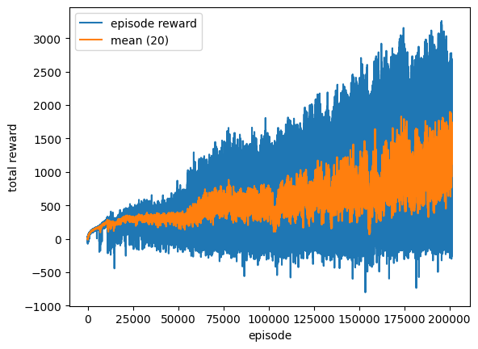

<!--
 Copyright (c) 2024 Louis Jouret

 This software is released under the MIT License.
 https://opensource.org/licenses/MIT
-->

# Bipede

A personal robotics project: a custom-designed bipedal robot that learns to walk with
reinforcement learning in MuJoCo.

The repository contains:

- The CAD meshes of the robot parts in `assets/`
- The MuJoCo model of the biped (bodies, joints, motors, contacts) in `bipede.xml`
- The RL code in the `bipede/` Python package — a PPO trainer, evaluation tools,
  and a live training monitor

## Results

https://github.com/user-attachments/assets/36ef6f29-8426-4234-baa6-e87809ea6633

The learning curve is in `progress_ppo.png`, regenerated at every checkpoint:



## Layout

| Path | What it is |
| --- | --- |
| `bipede/ppo.py` | PPO agent and trainer (TensorFlow) — the main training entry point |
| `bipede/env.py` | MuJoCo model loading, PD controller, observation, reward shaping, termination |
| `bipede/eval.py` | Watch a trained policy in the live viewer, or record it to an mp4 |
| `bipede/watch.py` | Live matplotlib monitor that re-reads the training log while training runs |
| `bipede.xml` | MuJoCo model of the robot |
| `assets/` | `.obj` meshes referenced by `bipede.xml` |
| `motor_control_tests.ipynb` | Early PD-controller / motor experiments |

Training runs headless as a script (robust for long runs); rendering only happens in
`bipede.eval` and in the periodic gait recordings.

## Setup

Dependencies: `mujoco`, `tensorflow`, `numpy`, `matplotlib`, `mediapy` (video recording).
A virtualenv in `.venv/` is assumed below.

## Training (PPO)

```bash
python -m bipede.ppo --fresh --watch
```

Training runs until `--steps` environment steps (default 100M — interrupt whenever the
gait looks good, checkpoints are saved continuously). For a long run, launch it in the
background so it survives the terminal closing:

```bash
nohup python -m bipede.ppo --fresh > train.out 2>&1 &
```

Useful flags (see `python -m bipede.ppo --help` for the full list):

- `--fresh` — start from scratch (omit to resume from the checkpoint in `networks_ppo/`)
- `--steps N` — total environment steps
- `--rollout N` — env steps collected per PPO update (default 4096)
- `--control {position,torque}` — action space: PD position references (default) or raw joint torques
- `--rsi F` — fraction of episodes started from a mid-gait snapshot (default 0.5, see below)
- `--video-every N` — record a gait video every N episodes into `--video-dir` (default 1000 → `gait_videos/`)
- `--horizon-start/--horizon-end` — episode time-limit curriculum (default 3 s → 10 s)
- `--ent-coef/--ent-coef-end` — entropy coefficient annealing (default 0.01 → 0)
- Reward shaping: `--alive`, `--target-v`, `--fall-penalty`, `--joint-vel-cost`,
  `--air-time-weight`, `--clearance-weight`
- `--watch` — also open the live plot window (spawns `bipede.watch`, closed on exit)

### What the trainer does

- **Policy**: diagonal Gaussian over a normalised [-1, 1] action space per joint, mapped
  to PD reference angles (or torques). 512×512 tanh MLPs; the actor's output layer is
  zero-initialised so an untrained policy holds the standing pose instead of collapsing.
- **PPO**: GAE(λ) advantages, clipped surrogate objective, minibatch epochs with a
  KL-based early stop, gradient clipping.
- **Gentle exploration**: this action space drives a stiff PD controller, so noise is
  violently destabilising — the learnable log-std starts at exp(-2.5) ≈ 0.08 and is
  floored at exp(-3.0) so exploration can never collapse or explode.
- **Reference State Initialization (RSI)**: a rotating bank of mid-gait `(qpos, qvel)`
  snapshots harvested from the policy's own healthy rollouts; half of the episodes start
  from one, so the policy practices steps 3, 4, 5… instead of spending all its data on
  the first two steps from standstill.
- **Curricula**: the episode time limit ramps from 3 s to 10 s over the first half of
  training, and the entropy bonus anneals to zero so the gait can sharpen.
- **Gait shaping**: besides forward velocity and an alive bonus, completed steps are
  rewarded via foot air-time credited at touchdown and swing-foot clearance, with a
  joint-velocity penalty against vibration and a one-off fall penalty.
- **Observation (32-dim)**: hip height, gravity direction in the body frame, sin/cos of
  yaw, joint angles, and scaled base/joint velocities — translation-invariant.

### Outputs

Written to the project directory while training:

- `networks_ppo/` — latest checkpoint (`actor.weights.h5`, `critic.weights.h5`, `log_std.npy`)
- `networks_ppo_best/` — best-so-far checkpoint (by 20-episode mean reward), so a late
  collapse can't erase a good policy
- `training_log_ppo.csv` — one row per episode (`episode, distance_m, total_reward, steps`),
  flushed each episode so it can be read live
- `progress_ppo.png` — the learning curve, rewritten at every checkpoint
- `gait_videos/ep_XXXXXX.mp4` — a fresh deterministic rollout with a tracking camera,
  recorded every `--video-every` episodes (these clips make up `gait_progress.mp4`)

### Live plot

Either pass `--watch` to the trainer, or launch the watcher in another terminal:

```bash
python -m bipede.watch                 # refresh every 3 s
python -m bipede.watch --interval 5    # or slower
```

It re-reads `training_log_ppo.csv` and redraws the reward and distance curves (with
rolling means) live.

## Watching a trained policy

```bash
.venv/bin/mjpython -m bipede.eval                        # live viewer (macOS needs mjpython)
python -m bipede.eval --video gait.mp4                   # headless: record an mp4 instead
python -m bipede.eval --networks networks_ppo_best       # use the best-so-far checkpoint
```

The live viewer runs deterministic episodes back-to-back with a tracking camera and
prints distance, reward and time upright per episode. Episodes run until the robot
actually falls (not the training time limit); recordings are hard-capped by
`--max-seconds` (default 100 s). If the checkpoint was trained with `--control torque`,
pass the same flag here.
